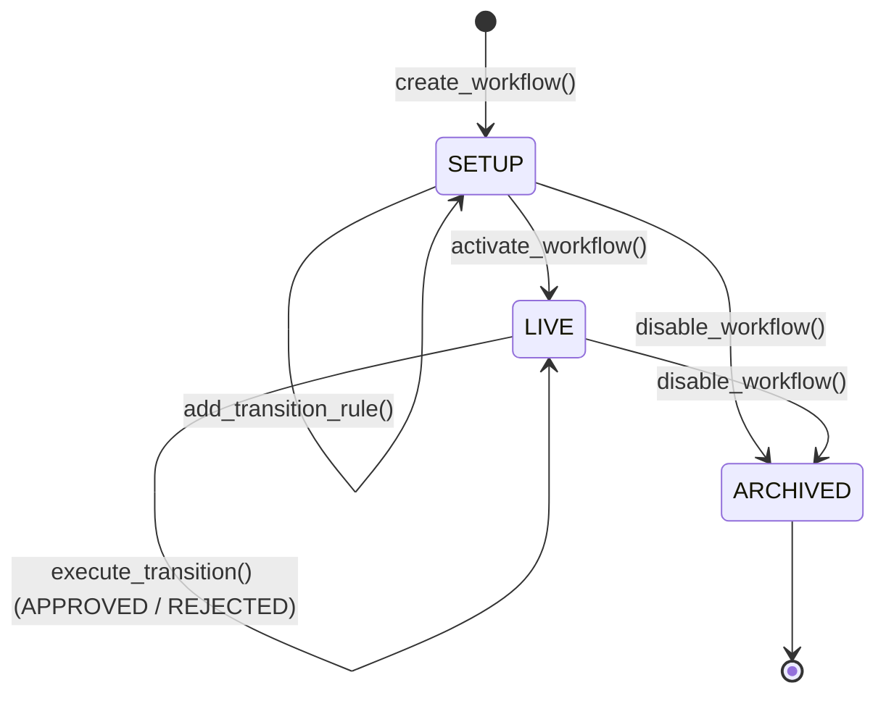

# Scaffolderon Architecture

## Core Philosophy
Scaffolderon is designed to execute human-readable semantic state transitions on GenLayer Studio Net. It bridges the gap between deterministic state machine logic (state validation, authorization) and non-deterministic logic (evaluating natural language rules against provided evidence).

## Smart Contract Components

### 1. Storage (`TreeMap`)
To adhere to GenLayer best practices and maintain O(1) read/write efficiency, Scaffolderon completely avoids unbound arrays (`DynArray`) or lists. Instead, it relies on cryptographic mapping via `TreeMap`:
- `workflows`: Maps a `workflow_id` to its JSON serialized state.
- `rules`: Maps a `rule_id` to its JSON serialized state.
- `executions`: Maps an `exec_id` to its JSON serialized state.

### 2. Cryptographic Integrity (Hashing)
Every major entity inside the contract is bound by a deterministic, domain-separated SHA-256 hash. 
- Prevents tampering or unrecorded state mutation.
- `exec_hash` strictly binds the workflow version (`version_prior`) to the execution, ensuring a semantic transition cannot be replayed or evaluated against the wrong state.

### 3. The Prompt Engine (Semantic Consensus)
When an operator calls `execute_transition`, the contract builds a sandboxed prompt:
1.  **Prefix:** Establishes the evaluator persona and strict JSON output rules.
2.  **Criteria:** The untrusted transition rule defined by the workflow owner.
3.  **Evidence:** The untrusted context provided by the operator.
4.  **State Context:** The current and target states.

This unified payload is passed to `gl.nondet.exec_prompt()`. The system guarantees that both the **Leader** and the **Validator** reach the same semantic conclusion (`APPROVED`, `REJECTED`, `AMBIGUOUS`) before the state version increments.

## Lifecycle Diagram

